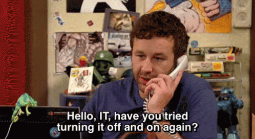

Readme.md

# Purpose of the Project #

The IT department ask you to create a website that will have to retrieve from an API all the recent movies, when clicking on a movie, you will display in a modal, its additional information, such as its synopsis, a trailer if it exists and the casts.

# Technologies used #

      

# Members of the Group #

Kevin-May [@yashidao] (https://github.com/Yashidao)
Pierre [@Pierrerobeyns] (https://github.com/Pierrerobeyns)
Sarah [@sarah-jpro] (https://github.com/sarah-jpro)
Mara [@mara85kh] (https://github.com/mara85kh)

# Graphic Guideline #

# Project Management #

# Screenshot #

TBC

# Working in IT Be Like #

